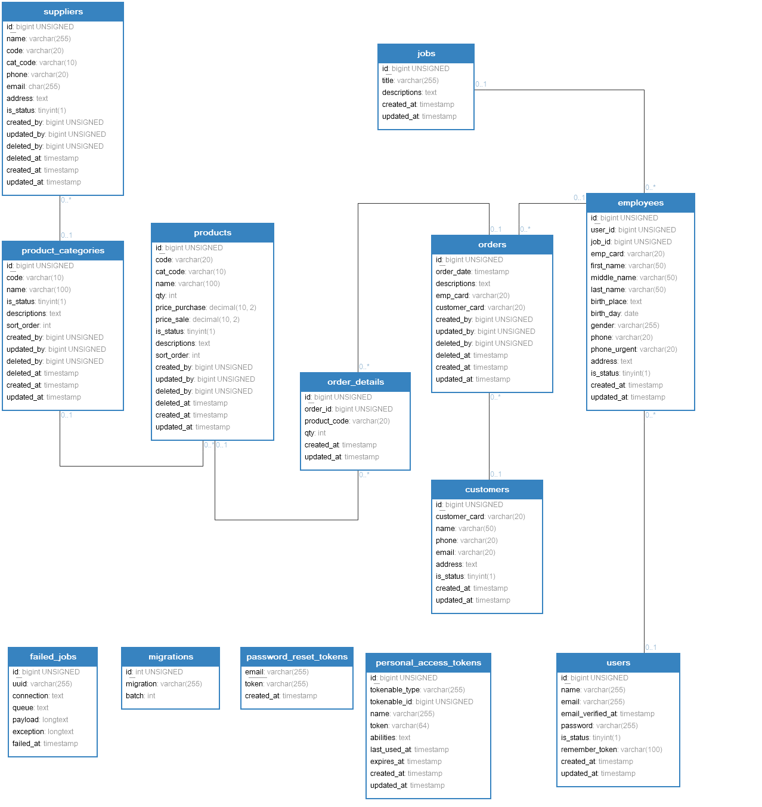
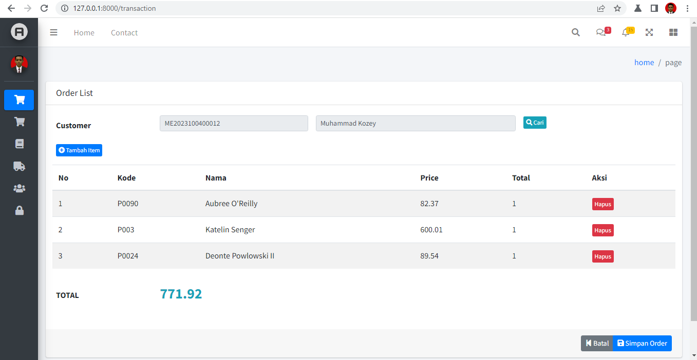
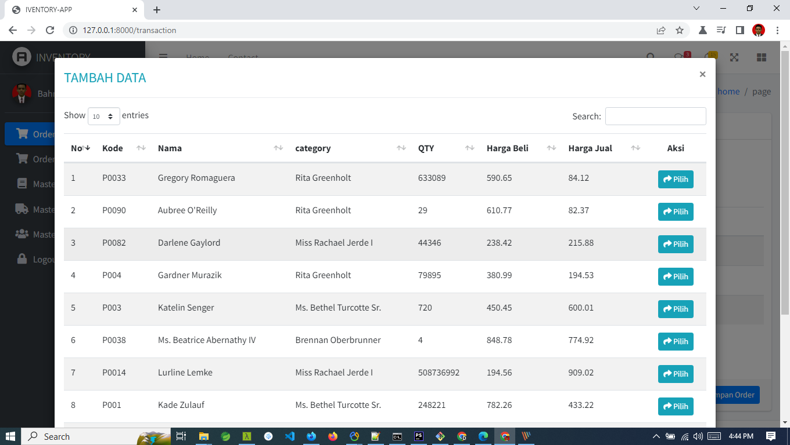
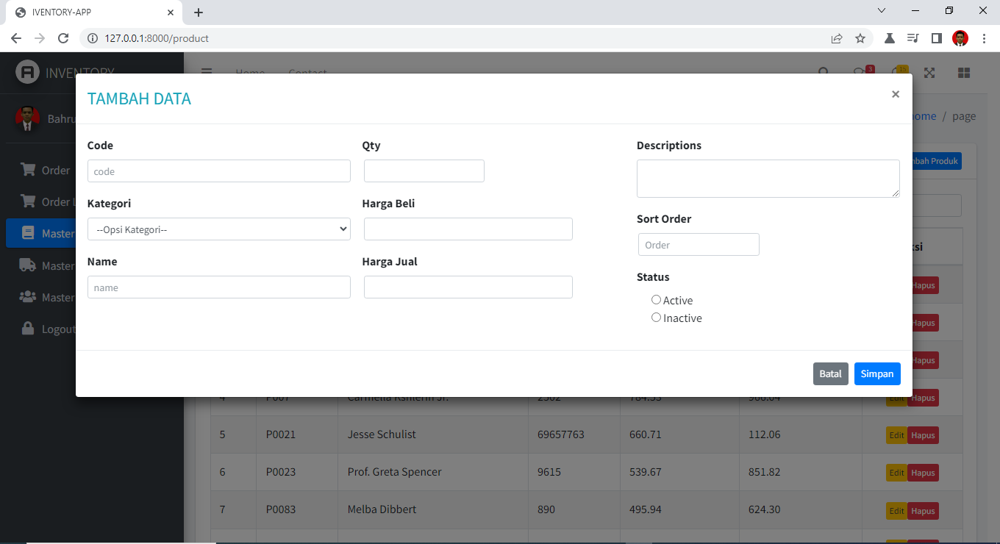
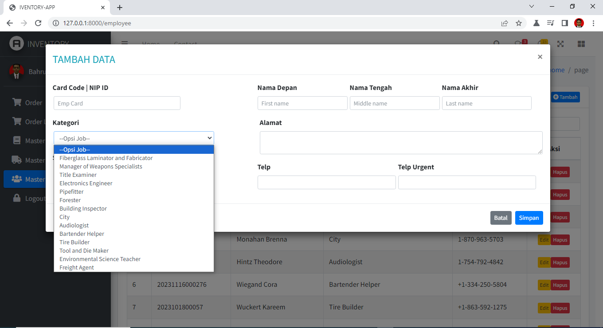
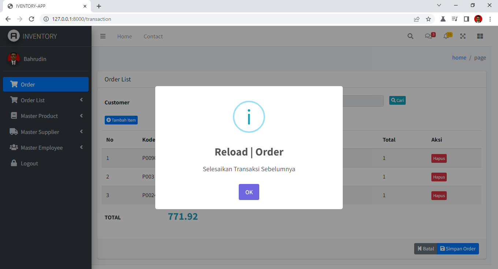

## About Inventory App

Project web application for web programmer challenge job in indonesia.

## Module

- Employee, Job, Customer, Supplier, Product,
- Role Access [Breeze](https://laravel.com/docs/10.x/starter-kits).

## Learning

- [Laravel Framework](https://laravel.com/docs)
- [Laravel Breeze](https://laravel.com/docs/10.x/starter-kits)
- [Datatables Library](https://yajrabox.com/docs/laravel-datatables/10.0/installation)
- [Bootstrap UI](https://getbootstrap.com/)
- [jQuery Ajax](https://api.jquery.com/jQuery.ajax/)
- [AdminLTE](https://adminlte.io/)
- [Sweet Alert2](https://sweetalert2.github.io/)

## Motto

"Ora Ngapak Ora Kepenak"

## How To Run

- composer install
- env.example ganti nama .inv (setting database)
- php artisan key:generate
- php artisan migrate --seed

#### Manual

- composer install
- env.example ganti nama .inv (setting database)
- php artisan key:generate
- import record data : folder database-manual

#### Sample login

- user: bahrudin.no8@gmail.com
- pass: brebes

 

#### Social Media

- [youtube Cannel 1](https://www.youtube.com/channel/UCN0yfzTEmuaaJjcaepxRUdg)
- [youtube Cannel 2](https://www.youtube.com/channel/UCgVUWSLwgxCmApG-euAVfew)
- [Linkedin](https://www.linkedin.com/in/bahrudin)
